# ╭─ elyes@ghazel in ~
# ╰─ ⫸ Junior Security Researcher & Automation Enthusiast 🇨🇭

  
  
  

---

### 🔍 Discovery
I am a student developer based in Switzerland, dedicated to building secure systems and automating away the boring stuff. I thrive in the terminal and believe that if you have to do it twice, you should script it.

* **🔒 Focus:** Pentesting, Network Security, and System Hardening.
* **⚡ Current Lab:** Running private services on my own metal (Proxmox/Docker/Linux).
* **🚫 Friction:** I avoid Java boilerplates and CSS centering struggles at all costs.

---

### 🛠️ Tech Stack

| Category | Tools & Languages |
| :--- | :--- |
| **Languages** |     |
| **Frameworks** |    |
| **DevOps & Sec** |     |

---
### 📊 System Performance & Activity

  
   
  

---

### 📂 Projects Overview
* **[99_config](https://github.com/elyesghazel/config):** My personal Dotfiles (Fish/WSL/Vicinae).

---

  "If it's not automated, it's a bug." ⫸ 

